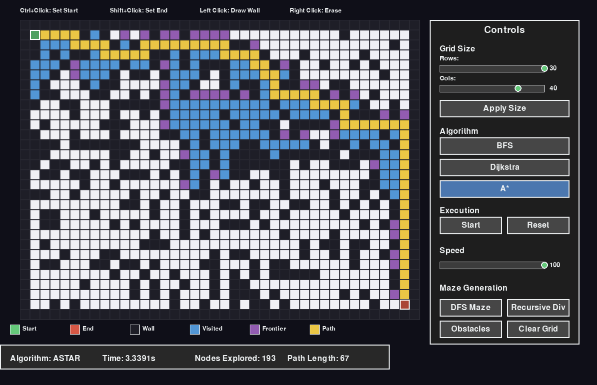

# Maze Solver - Pathfinding Visualizer

A comprehensive interactive visualization tool for pathfinding algorithms with maze generation, real-time animation, and performance comparison.



## 🌟 Features

### Pathfinding Algorithms
- **Breadth-First Search (BFS)** - Guarantees shortest path, explores uniformly
- **Dijkstra's Algorithm** - Optimal for weighted graphs
- **A\* (A-Star)** - Heuristic-based, most efficient for pathfinding

### Maze Generation
- **Randomized DFS** - Creates perfect mazes with high complexity
- **Recursive Division** - Divides space recursively with passages
- **Binary Tree** - Simple algorithm with distinct patterns
- **Random Obstacles** - Customizable obstacle density

### Interactive Features
- **Real-time Visualization** - Watch algorithms explore the maze step-by-step
- **Speed Control** - Adjust animation speed with slider (1-100)
- **Interactive Drawing** - Draw/erase walls with mouse
- **Pause/Resume** - Control algorithm execution
- **Comparison Mode** - Compare multiple algorithms side-by-side
- **Save/Load** - Save and load custom mazes
- **Export** - Export mazes as images, create GIFs

### User Interface
- **Control Panel** - Intuitive buttons and sliders
- **Status Bar** - Real-time statistics and progress
- **Color Legend** - Visual guide for cell states
- **Keyboard Shortcuts** - Quick access to features

## 📋 Requirements

```bash
Python 3.8+
pygame
Pillow (PIL)
numpy
